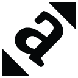

# allmark - the tiny markdown server

allmark is a lightweight markdown web server for Linux, BSD, Solaris Mac OS and Windows written in go.



## Build Status

[](https://travis-ci.org/andreaskoch/allmark)

## Installation

If you have [go](https://golang.org/dl/) (≥ 1.3) installed all you have to do is

1. Clone the project from github
2. Run the `make.go` file with the `-install` flag

```bash
git clone git@github.com:andreaskoch/allmark.git
cd allmark
go run make.go -install
```

Afterwards you will find the `allmark` binary in the bin-folder of the project. To test your installation you can start by serving the allmark-project directory:

```bash
cd allmark
bin/allmark serve
```

After a second or so a browser window with this address `http://0.0.0.0:8080` should pop up. Or if it doesn't just type `http://localhost:8080` into your browser:


## Demo / Showcase

If you want to see **allmark in action** you can visit my blog [AndyK Docs](https://andykdocs.de/) at [https://andykdocs.de](https://andykdocs.de):


## Dependencies

allmark relies on many great third-party libraries. These are some of them:

- [github.com/bradleypeabody/fulltext](src/github.com/bradleypeabody/fulltext)
- [github.com/gorilla/context](src/github.com/gorilla/context)
- [github.com/gorilla/mux](src/github.com/gorilla/mux)
- [github.com/jbarham/go-cdb](src/github.com/jbarham/go-cdb)
- [github.com/nfnt/resize](src/github.com/nfnt/resize)
- [github.com/russross/blackfriday](src/github.com/russross/blackfriday)
- [github.com/shurcooL/go/github_flavored_markdown/sanitized_anchor_name](src/github.com/shurcooL/go/github_flavored_markdown/sanitized_anchor_name)
- [github.com/skratchdot/open-golang/open](src/github.com/skratchdot/open-golang/open)
- [golang.org/x/net/websocket](src/golang.org/x/net/websocket)

These are not under allmark copyright/license. See the respective projects for their copyright & licensing details.
These are mirrored into allmark for hermetic build reasons and versioning.

To get a full list of all used third-party libraries you execute the make tool with the `-list-dependencies` flag:

```bash
go run make.go -list-dependencies
```pod.nasa.gov/apod/image/1104/
go run make.go -update-dependencies
```

## Cross-Compilation

If you want to cross-compile allmark for different platforms and architectures you can do so by using the `-crosscompile` flag for the make script (if you have [docker](https://www.docker.com) >= 1.4 installed):

```bash
go run make.go -crosscompile
```

This command will launch a [docker container with go 1.4](https://registry.hub.docker.com/u/library/golang/) in it that is prepared for cross-compilation and build allmark for you. The output will be available in the `bin` folder of this project:

```
bin/
├── allmark
..
├── darwin_amd64
│   └── allmark
..
├── dragonfly_amd64
│   └── allmark
..
├── freebsd_amd64
│   └── allmark
├── freebsd_arm
│   └── allmark
..
├── linux_arm
│   └── allmark
..
├── nacl_arm
│   └── allmark
..
├── netbsd_amd64
│   └── allmark
..
├── openbsd_amd64
│   └── allmark
..
├── windows_amd64
│   └── allmark.exe
├── ...
├── README.md
└── src

```

If you don't have docker or don't want to install it you can use [goxc](https://github.com/laher/goxc) to cross-compile allmark.

## Known Bugs

### Default Theme

- Responsive Design: The default theme always selects the smallest thumbnail size which makes the previewed images look crappy on large screens.

### Windows

- Fileystem links: Serving folders that are fileystem junctions/links is no longer possible with go 1.4 (it did work with go 1.3)

## Roadmap / To Dos

Here are some of the ideas and todos I would like to add in the future. Contributions are welcome!

### Architecture

- Expose the markdown source
- HTTPs support
- Run on Raspberry Pi / WDLXTV ("Host your blog from your home")
    - store images and thumbnails on amazon s3
    - can be run with very little bandwidth
    - DDNS support
- Data Access
    - Dropbox support
    - SMTP message posting
    - Repository Replication?
    - Amazon S3
- allmark swarm
    - Repository sharding
    - load-balancing
- Static website generation

### Features

- User Management / Access Restrictions
    - User management pages
- Editing
    - sublime snippets
    - sublime theme
    - Examples
- Posting comments
- Make live-reload more intelligent and more efficient

### Theming

- Redesign default theme with Twitter Bootstrap
- Create a theme "loader"
- Infinite Scrolling for latest items

### Rendering / Markdown extensions

- 360° panoramas
- image galleries (implemented but needs improvement)
- file lists (implemented but needs improvement)
- cross references
- geo locations
